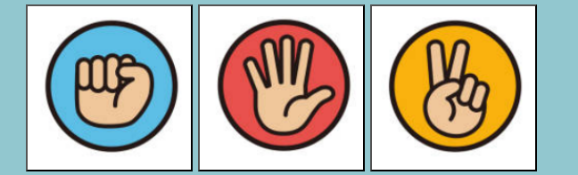
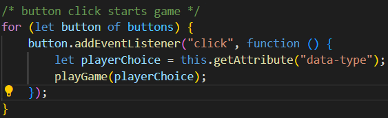
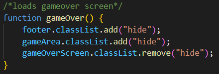

# Rock, Paper, Scissors

Rock Paper Scissors is a fun game based on the classic Rock, Paper, Scissors. It incorporates chance mechanics to allow users to compete against their own high score in a limited number of lives.

It provides lighthearted fun to de-stress and relax but adds just the right level of competitiveness to keep users engaged. 

-https://danparkinso-project2rps-4ixxhuzfxk0.ws-eu114.gitpod.io

-https://danparkinson.github.io/project2rps/

## Planning 

## Target Audience

People who are looking to relax by playing a simple yet challenging game of rock paper scissors.

### User Goals 

- Play Rock, Paper, Scissors.
- learn the rules of Rock, Paper, Scissors.
- Challenge themselves by beating their high score.

### Site Owner Goals

- Teach users how to play Rock, Paper Scissors.
- Allow users to play Rock, Paper, and Scissors.
- Allow users to compete against themselves by beating their high score.
- Engage in a challenging game that limits users with a set amount of lives.

### User Stories

- As a user, I want to be able to play Rock, Paper, Scissors on various device sizes.
- As a user, I want to know the rules of Rock, Paper, Scissors.
- As a user, I want to challenge myself to beat my high score.
- As a user, I want to be able to see the computers' choice to know if I have won, drawn or lost.
- As a site owner, I want users to understand the rules and play the game Rock, Paper, Scissors.
- As a site owner, I want users to visit the website multiple times.

### Features to achieve these goals

- The website uses a responisve design that can be seen clearly on different devices.
- To allow new players to access the game we included the rules in the footer.
- To allow users to challenge themselves to beat their high scores the website loads the high score from their local storage.
- The website clearly shows the player and computer choices for each round played.
- To add challenge a lives system is included which decreases each time the player loses. 

### Colour scheme
The Colour Hunt website was used to choose the colour scheme. 
The colours where chosen to give a relaxed feeling to users but also aid in visibility for any visually imparied users. 

https://colorhunt.co/palette/92c7cfaad7d9fbf9f1e5e1da

### Wireframes

Figma Wireframes was used to create the wireframe. A simple one size fits all design that would only need to be scaled for different screen sizes.

https://www.figma.com/design/xG2N96cHdC29XXobLBx1vY/Figma-basics?node-id=601-10&t=5aTYeRgYSjFxa1A4-0

## Existing Features

### Heading
- The heading is clear and unambiguous about the what the site provides to users through a bold title of "Rock, Paper, Scissors"

### Controls area

- The controls area is designed to add content to the page instead of just buttons with words. Clear pictures of the users choices as well as a responsive design to indicate that they are buttons.

### Choice area
- This area is designed to show both user and computer choices with matching image designs to the intial buttons. As well as feedback of the result during the round in colour responsive text. 

### Score area
- The score areas purpose is to show the current and high scores. As well as the lives the user has remaining. The current score updates with each win and restarts after each playthrough, The high score updates with the highest score the local device has achieved. The lives reduce with each loss and trigger the game to end. 

### Game over screen
- The game over screen is simply designed to show clearly that the game has finished. Initially the html is hidden but once the lives counter reaches 0 it will open. It contains a big centralised restart button to get users to continue playing. 

### footer
- The footer contains the rules of the game to allow new users to understand the decisions and better progress their high score. 

## Javascript

### Javascript code

- Loads DomContent and checks for highscore

- Allows the buttons to start the game when clicked

- Allows restart button to restart the game

### play game function

- Generates computer choice from array using random number

- Switch that compares player choice to computer choice

- Updates choice area with images adn alt text of player and computer choice. Displays result. Removes any colour of the results applied later.

- Switch updates score or lives. applies green or red text of result. triggers gameover function.

- If statement that updates highscore to DOM if higher than previous. 

### Game over function 

- game over function when lives = 0.

### Restart function

- restart function triggered by play again button.

## Features left to implement
- A 2player version allowing player2 to replace the computer
- A version of Rock, Paper, Scissors, Lizard, Spock to be selected
- A global leaderboard

## Testing

- Tested with different browsers such as Chrome, Firefox and Safari.
- Tested different screen sizes with developer tool.
- Tested all buttons start the game and give correct outcomes.
- Tested all choice selections are correct for both player and computer. 
- Tested high score stays after the page is refreshed.
- Tested lives decrease with each loss and when Lives hit 0 game over screen shows.
- Tested the restart button restarts the game.

User story testing

| User story                                                                                    | Expeceted result | Pass |
| ----------------------------------------------------------------------------------------------|--------------------------------------------------------------------|------|
| As a user, I want to be able to play Rock, Paper, Scissors on various device sizes.           | Screen sizes responsive on all screen types                        |&check; |   
| As a user, I want to know the rules of Rock, Paper, Scissors.                                 | Rules included in the footer                                       |&check; | 
| As a user, I want to challenge myself to beat my high score.                                   | Highscore is saved and loaded locally to allow users to come back  |&check; | 
| As a user, I want to be able to see the computers choice to know if I have won, drawn or lost.| Choice area display graphics of user and computer choice as well as the result |&check; | 
| As a site owner, I want users to understand the rules and play the game Rock, Paper, Scissors.| Rules and game included to allow users to do this                  |&check; | 
| As a site owner, I want users to visit the website multiple times.                            | Players encouraged to come back to beat their high score           |&check; | 

## Validator Testing

### HTML

The html code passed all checks except for two empty image sections inside the choice area. This was left as the images are populated with src and alt text when the users clicks on one of the control buttons. Error left in.

## CSS

- No errors found

## Javascript

### Warnings Fixed

- missing semicolon on line 4.
- missing semicolon on line 40.
- missing semicolon on line 47.
- missing semicolon on line 58.
- missing semicolon on line 83.
- missing semicolon on line 125.

### Warnings not Fixed
- line 37 Functions declared within loops referencing an outer scoped variable may lead to confusing semantics. (playGame)
- line 45 Functions declared within loops referencing an outer scoped variable may lead to confusing semantics. (restart)

- not fixed as Code Institute tutorial said they were okay.

### Errors

- No errors

### Lighthouse report

- Lighthouse reported no issues with the website.

## Deployment 

- website fully deployed to GitHub pages

## Credits

- Rock paper scissors images from https://www.shutterstock.com/image-vector/colorful-hand-icon-set-rock-paper-2151726093
- inspiration for playgame() switch mechanic in game came from https://www.youtube.com/watch?v=3uKdQx-SZ5A
- favicon from https://favicon.io/emoji-favicons/raised-fist
- screen size image - https://techsini.com/multi-mockup/index.php
- flow diagram https://app.smartdraw.com/editor.aspx?templateId=5375d76a-18f5-49fc-bb02-78cfb46beb7e&flags=128#depoId=57672055&credID=-64393477